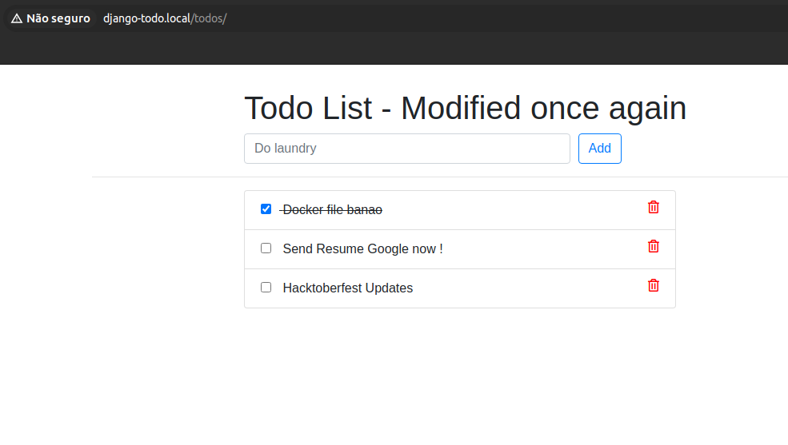

# django-2do: atividade prática sobre kubernetes

Atividade desenvolvida na disciplina de virtualização do curso superior de tecnologia em redes de computadores do IFPB (2023).

## Instruções

Faça o deployment em sistema de orquestração de conteineres local (minikube) da aplicação "django-todo", no repositório https://github.com/diegoep/django-todo.

Essa é uma aplicação Python/Django que roda um banco de dados Sqlite embarcado na própria aplicação.



Na atividade é solicitado ao aluno que:

 1. Faça a construção da imagem docker da aplicação (lembre de rodar "eval $(minikube docker-env)" para usar o docker do ambiente do minikube
    
 1. Crie os manifestos Kubernetes para implantar a aplicação django-todo e externalizar o acesso: Deployment, service, ingress
    
 1. Pesquise e indique como seria possível manter estado em múltiplas execuções, visto que a aplicação armazena os dados em um sqlite rodando no próprio container.
    


## pré-requisitos

## instalando kubectl e minikube

## projeto

## deployment

Iniciar deployment:
```console
   kubectl apply -f deployment.yaml
   kubectl apply -f service.yaml
   kubectl apply -f ingress.yaml
```

Interromper deployment:
```console
   kubectl delete deployment django-todo-deployment
   kubectl delete service django-todo-service
   kubectl delete ingress django-todo-ingress
```
